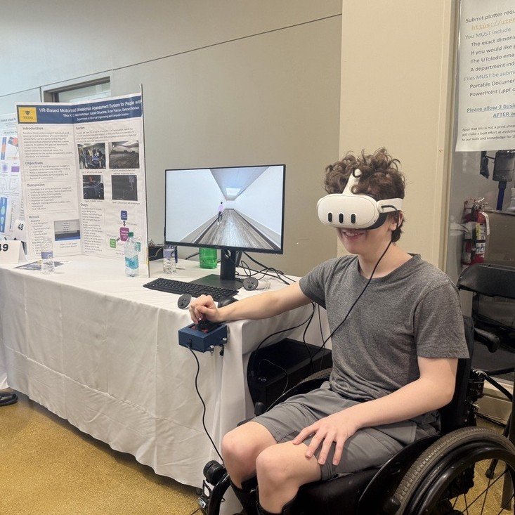

# VR-Based Motorized Wheelchair Assessment System (Case Study)

> ⚠️ *Due to institutional IP ownership by the University of Toledo and Sunshine Communities, this repository contains only documentation and visual references. Source code, Unity assets, and software IP are not publicly available.*

A collaborative senior design project that developed an immersive, physics-based Virtual Reality (VR) training and assessment system for powered wheelchair users. The simulation enables users to practice real-world mobility skills using a joystick or adaptive head-array controller, while collecting quantifiable performance metrics through a custom-built assessment module.

---

## 🧠 Project Overview

- Built in collaboration with **Sunshine Communities (Maumee, OH)** and faculty at the **University of Toledo**
- Team of engineering seniors specializing in **Computer Science**, **Electrical Engineering**, and **Human-Centered Design**
- Developed to serve individuals with varying physical and cognitive abilities seeking motorized wheelchair access
  

---

## 🎯 Objectives

1. Create a **realistic VR environment** for motorized wheelchair assessment
2. Enable **multiple control inputs** – joystick & custom head array
3. Build a **collision detection and scoring system** for skill evaluation
4. Provide **quantitative, therapist-friendly performance metrics**
5. Design **modular VR scenarios** simulating indoor mobility challenges

---

## 🧩 My Role (≈45% Contribution – Hardware, Software, Rendering, and Deployment)

**Hardware Integration & Prototyping**
- Co-developed a custom **ESP32-based head-array controller** using pressure sensors and a battery-powered circuit
- Collaborated on the **3D printing** of both the joystick cage and head-array housing for physical integration
- Programmed the ESP32 for both **Bluetooth HID** and **Serial USB communication**, ensuring fallback compatibility with Meta Quest and Unity

**Unity Development & System Integration**
- Co-programmed the **collision detection and scoring system**, including obstacle-type categorization and penalty weight logic
- Managed **rendering pipeline and material optimization** using Unity URP for VR stability and visual fidelity
- Handled **camera stabilization**, including head-angle decoupling and motion smoothing to reduce VR motion sickness
- Converted the full Unity VR simulation into a deployable **.exe desktop application**, resolving IL2CPP/Mono build issues

**Collaboration & Testing**
- Participated in hardware-software integration under rapid prototyping constraints
- Conducted technical and usability testing alongside therapists and wheelchair users to validate input accuracy and simulation realism

---

## 🧰 Tools & Technologies

| Category               | Tools / Frameworks                                       |
|------------------------|----------------------------------------------------------|
| VR Simulation          | Unity 6, XR Interaction Toolkit, Meta Quest 2            |
| Hardware Input         | ESP32, Arduino IDE, Pressure Sensors, Serial & Bluetooth |
| Physics + Interaction  | Unity Physics Engine, C#                                  |
| 3D Assets              | Blender, Meshroom (Photogrammetry)                        |
| Testing & Reporting    | In-house logging tools, therapist interview protocols     |

---

## 🖼 Sample Environments

- Indoor hallways with narrow turns  
- Static obstacles like ramps, doors, cones  
- Dynamic NPCs simulating pedestrian traffic  
- Wayfinding tasks with audio-visual feedback  

> 🎞️ Demo and images available upon request for employers under NDA or review.

---

## 🛡️ Challenges & Solutions

| Challenge                           | Solution                                                                 |
|------------------------------------|--------------------------------------------------------------------------|
| Motion sickness in early VR builds | Decoupled camera from wheelchair rig + added smoothing filters           |
| ESP32 integration issues           | Modular input architecture + fallback to USB Serial protocol             |
| Physics instability in collisions  | Custom wheel collider logic, constrained Rigidbody components            |
| Build errors in IL2CPP             | Shifted to Mono backend and updated Unity APIs                           |

---

## 📊 Results & Validation

- Realistic wheelchair controls with multiple input modes
- 100% collision detection accuracy across dynamic/static obstacles
- Score tracking with detailed session reports and breakdowns
- Positive feedback from mobility trainers and first-time users
- Reduced motion sickness through optimized camera movement

---

## 🔮 Future Expansion

- Support for sip-and-puff or eye-tracking inputs  
- Outdoor and transportation simulation modules  
- Machine learning-based performance analysis  
- Real-world architecture import for accessibility validation  

---

## 📚 Documentation & Visuals

This repo includes:
- System Architecture Diagram 
- Photos of Head-Array Controller 
- Screenshots of VR Environments 
  
  
- Demo Clip 

> All media shared complies with IP constraints and is sanitized of proprietary elements.

---

## 🤝 Acknowledgements

- **Partner Organization**: [Sunshine Communities, Maumee, OH](https://sunshine.org)  
- **University**: University of Toledo, Department of Engineering  
- **Advisors**: Dr. Liang Cheng, Mehzabien Iqbal, Dr. Ashish Kharel, Kelsey Garner, Jeffrey Walter  
- **Team Members**: Sakshi Dhumma, Nick Hemmert, Evan Palmer, Tika K. C., Simran Shekhar

---

## 📫 Contact

**Sakshi Dhumma**  
Dual B.S. in Computer Science & Electrical Engineering  
📍 Toledo, OH | 📧 sakshidhumma@email.com  
🌐 [Portfolio](https://yourportfolio.com) | [LinkedIn](https://linkedin.com/in/sakshidhumma/)

---

## 📄 Disclaimer

This case study is for documentation and professional showcase purposes only. All proprietary code and digital assets are the intellectual property of the University of Toledo and Sunshine Communities.

